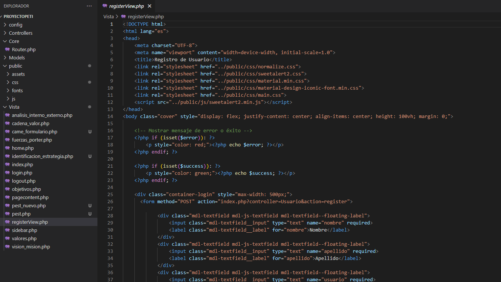

# Examen Práctica Unidad II - PETI", "Mario ANtonio Flores Ramos", Fecha : 28/05/2025

# URL del repositorio Github : https://github.com/Marant7/PE_II_EXAMEN_PRACTICO.git

# Capturas de imágenes del sistema :

# Descripción:

### Implementacion de la base de datos para guardar con encryptacion 

# Capturas de imágenes del sistema :

# Descripción:

### Se cambio para adaptarlo a mvc y utilizar el index=id?

# Capturas de imágenes del sistema :

# Descripción:

### se realizo el cambio para el registro y se adapto mejor

# Capturas de imágenes del sistema :

# Descripción:

### se mejoro y se pudo crear en la base de datos el registro
# Capturas de imágenes del sistema :

# Descripción:

### ahora se ingresa con el controlador funcionando al 100%
